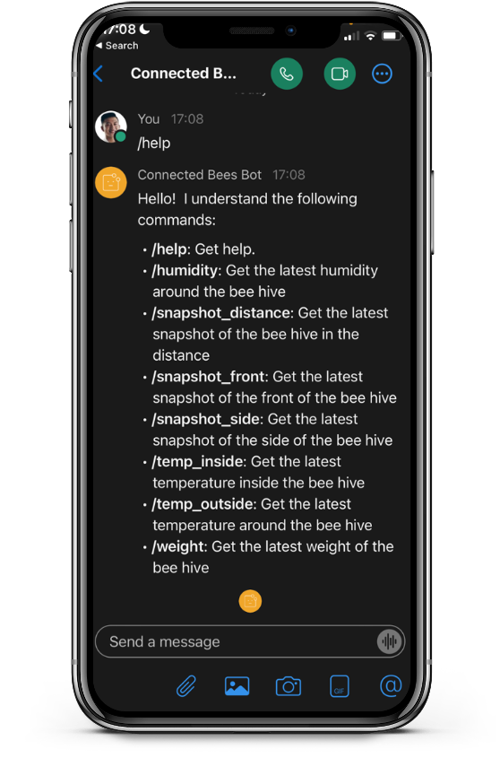
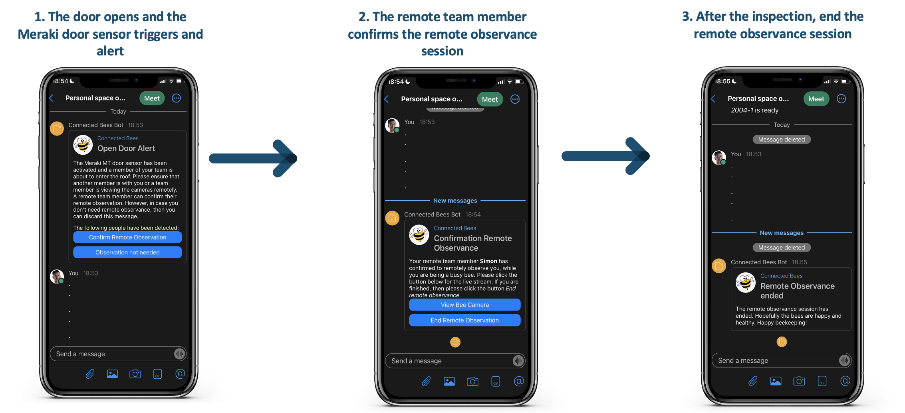
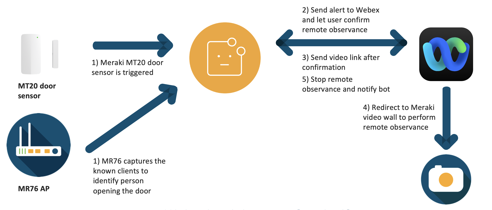

# GVE DevNet Meraki Alert Webex Bot Notification
Meraki has a broad portfolio including routers, switches, APs, cameras and sensors. The Meraki cloud is the backbone of the highly available, secure, and efficient Meraki solution. It allows for easy management and provisioning of the devices. Moreover, all the products and solutions are programmable, which allows us to build customization and integrations. In this Proof of Value (PoV), we have created an integration between the Meraki sensors, cameras and Webex. Once a Meraki MT sensor is triggered, an alert is sent to a Webex space along with a link to the video wall, which allows all the members of the Webex space to view the cameras an remotely observe the site after a sensor is triggered. 

Remote observance is especially useful for offices, for example, and remote observance is in demand due to the fact that we are transitioning towards a hybrid work experience. Moreover, in our use case, there is a bee hive located at the office. For safety reasons, bee hive inspections have to be done with two or more people. In the unlikely event of an accident, the second person can provide assistance or call the emergency services. However, since fewer people are attending the office, it is sometimes inconvenient to have two people doing the inspection. Therefore, we have created a process and integation that allows us to conduct remote observance, where one team member can do the bee hive inspection alone, while team members observe the site remotely and can contact assistance if needed. 

In addition to remote observance, the team would also like to monitor the honey bee colony. For this PoV, we have installed three Meraki MV cameras and a BEEP base, which encompasses multiple sensors to monitor a bee hive colony. We have created a bot that would interact during the remote observance process, but we have added features that allows the users to generate snapshots from the Meraki cameras or query the latest metric, e.g. temperature, humidity, weight, etc. 

In summary, the bot has the following functionalities:

* Remote observance system that starts after a Meraki MT door sensor is opened
* Generate snapshots from the Meraki MV cameras
* Query the latest metrics from the beep base, e.g. temperature, humidity, weight, etc.



## Overview
An overview of the **remote observance flow** that will take place through the bot:

The technical design of the PoV:


## Contacts
* Simon Fang (sifang@cisco.com)

## Solution Components
* Python 3
* Flask
* Meraki MT20 (door sensor)
* Meraki MV72 (camera)
* BEEP base

## How to obtain a Meraki API Key

In order to use the Cisco Meraki API, you have to enable the API for your organization first. After having enabled API access, you can generate an API key. You can follow the following instructions on how to enable API access and how to generate an API key:

1. Log in to the Cisco Meraki dashboard

2. In the left-hand menu, go to `Organization > Settings > Dasbhoard API access`

3. Click on `Enable access to the Cisco Meraki Dashboard API`

4. Go to `Profile > API access`

5. Under `API access`, click on `Generate API key`

6. Save the API key in a safe place. Please note that the API key will be shown only once for security purposes. In case you lose the key, then you have to revoke the key and regenerate a new key. Moreover, there is a limit of only two API keys per profile. 

> For more information on how to generate an API key, please click here [here](https://documentation.meraki.com/General_Administration/Other_Topics/Cisco_Meraki_Dashboard_API)

> Note: Make sure this API key has write access to both the source and target organization. You can add your account as Full Organization Admin to both organizations by following the instructions [here](https://documentation.meraki.com/General_Administration/Managing_Dashboard_Access/Managing_Dashboard_Administrators_and_Permissions).

## How to obtain the Meraki serial numbers
In order to get the details from certain devices, we have to specify the serial number. We can retrieve the serial number from the Meraki Dashboard. Follow the following steps in order to retrieve serial number for each device:

1. Log in to the Cisco Meraki Dashboard.

2. In the left-hand menu, go to `Cameras > Cameras` for cameras or `Wireless > Access points` for access points

3. Click on one of the device names, e.g. `example_camera_1`

4. (optional for cameras) Click on `Network`

5. On the left-hand table, you will see the `Serial Number`. Copy the serial number, because you will need this for the environment variables. 


## How to obtain a list of Meraki Device clients
For this PoV, we create a small database with known clients. The list of clients can be retrieved from the Cisco Meraki Dashboard. Follow the following instructions in order to obtain the client details:

1. Log in to the Cisco Meraki Dashboard.

2. In the left-hand menu, go to `Network-wide > Clients`

3. Click on one of the devices under description that you would like to add your 'known clients database', e.g. `Simons-iPhone`

4. (optional) Change the name to a simple custom name if needed by clicking on it

5. Copy the name and store it in the environment variables list later

## How to obtain a Webex Bot Token

In order to send notifications to a Webex space, we have created a Webex Bot. Follow the following instructions to create a Webex bot and its token: 

1. Log in to `developer.webex.com`

2. Click on your avatar and select `My Webex Apps`

3. Click `Create a New App`

4. Click `Create a Bot` to start the wizard

5. Following the instructions of the wizard: fill in details such as the bot name, bot username and choose an icon

6. Click `Add Bot` and you will be given access token

7. Copy the access token and store it safely. Please note that the API key will be shown only once for security purposes. In case you lose the key, then you have to revoke the key and regenerate a new key

> For more information about Webex Bots and how to create one, please see the [documentation](https://developer.webex.com/docs/bots).


## Webex Room ID

You have to specify the Room ID of the Webex space and you have to add the Webex Bot to the room space as well. 

In order to obtain the Room ID, you have to make a GET request to the following endpoint: 

> https://webexapis.com/v1/rooms

The response will be a list of JSON objects, which are the spaces that the user is part of. Find the space that you would like to send the notifications to and copy the Room ID. 

> For more information about how to obtain a Webex Room ID, please consult the following resource [here](https://developer.cisco.com/site/webex-101/). 


## How to obtain a BEEP API token
BEEP base is developed for bee keepers to collect real-time data about their bee colonies. Metrics that are collected include the temperature, humidity, weight and frequency that is emitted. These metrics allow the bee keepers to assess the health of the bee colonies and help them with the bee keeping overall. 

> For more information, please refer to their website [here](https://beep.nl/index.php/home-english)

In order to obtain the data that is collected by the BEEP base, we have to pull the data from the BEEP dashboard. In order to make API calls to the dashboard, we have to obtain a token. Please follow the instructions to obtain a token:

1. Create an account on [app.beep.nl](https://app.beep.nl)
2. Store your email and password in a safe place
3. Do a **POST** request to the following endpoint with your email and password as the parameters:

```
    https://api.beep.nl/api/login
```
4. The response will be a JSON dictionary and you can obtain the token from the key **token**. Store the token in the environment variables file under the variable `BEEP_API_TOKEN`. 

## Ngrok
If you are testing locally, then you need to have a public ip that tunnels back to your local machine. There are many solutions that can provide this service. In this PoV, we have chosen **ngrok**. If you have not downloaded it yet, then follow the following instructions:

1. Install ngrok via Homebrew:

```
    $ brew install ngrok/ngrok/ngrok
```

or download the ZIP file via [their website](https://ngrok.com/download) and then unzip ngrok from the terminal:

```
    $ sudo unzip ~/Downloads/ngrok-stable-darwin-amd64.zip -d /usr/local/bin
```

2. Add authtoken (sign up if you don't have one):

```
    $ ngrok authtoken <token>
```

> For more information about the download instruction of ngrok, then head over to [their website](https://ngrok.com/download) 


## Installation/Configuration

The following commands are executed in the terminal.

1. Create and activate a virtual environment for the project:
   
        #WINDOWS:
        $ py -3 -m venv [add_name_of_virtual_environment_here] 
        $ [add_name_of_virtual_environment_here]/Scripts/activate.bat
        #MAC:
        $ python3 -m venv [add_name_of_virtual_environment_here] 
        $ source [add_name_of_virtual_environment_here]/bin/activate
        
> For more information about virtual environments, please click [here](https://docs.python.org/3/tutorial/venv.html)

2. Access the created virtual environment folder

        $ cd [add_name_of_virtual_environment_here]

3. Clone this repository

        $ git clone [add_link_to_repository_here]

4. Access the folder `GVE_DevNet_Meraki_Alert_Webex_Bot_Notification`

        $ cd GVE_DevNet_Meraki_Alert_Webex_Bot_Notification

5. Install the dependencies:

        $ pip install -r requirements.txt

6. Open the `.env` file and add the environment variables. In the sections above, it is explained how to obtain these credentials and variables. Please note that all the variables below are strings, except for `MERAKI_DEVICE_CLIENTS`, which is a list of strings.

    ```python
    TEAMS_BOT_EMAIL = "<insert_teams_bot_email>"
    TEAMS_BOT_TOKEN = "<insert_teams_bot_token>"
    TEAMS_BOT_URL = "<insert_teams_bot_url>"
    TEAMS_BOT_APP_NAME = "<insert_teams_bot_app_name>"
    WEBEX_ROOM_ID = "<insert_webex_room_id>"
    BEEHIVE_ID = "<insert_beehive_id>" # optional
    BEEP_API_TOKEN = "<insert_beep_api_token>"

    MERAKI_API_KEY = "<insert_meraki_api_key>"
    MERAKI_NETWORK_ID = "<insert_meraki_network_id>"

    MERAKI_CAMERA_SERIAL_FRONT = "<insert_meraki_camera_serial_front>"
    MERAKI_CAMERA_SERIAL_SIDE = "<insert_meraki_camera_serial_side>"
    MERAKI_CAMERA_SERIAL_DISTANCE = "<insert_meraki_camera_serial_distance>"
    MERAKI_CAMERA_SERIAL_AP = "<insert_meraki_camera_serial_ap>"
    MERAKI_DEVICE_CLIENTS = ["<insert_list_of_names>"]
    ```


## Usage

Now is the time to launch the application! If you are testing locally, then you need to conduct one more step in between using `ngrok`. 

### Ngrok (local testing only)
Start an `ngrok` tunnel using the following command:

```
    $ ngrok http https://0.0.0.0:5001
```

You will obtain two public ip addresses. Copy the `https` address and paste that into the `TEAMS_BOT_URL` variable in the `.env` file.

### Server-hosted bot
If you have the application running on a server exposed with a public IP address, then copy the `https` address and paste that into the `TEAMS_BOT_URL` variable in the `.env` file.

Now simply type in the following command in your terminal:

    $ python bot.py

And head over to the following url:

```
https://0.0.0.0:5001
```


### LICENSE

Provided under Cisco Sample Code License, for details see [LICENSE](LICENSE.md)

### CODE_OF_CONDUCT

Our code of conduct is available [here](CODE_OF_CONDUCT.md)

### CONTRIBUTING

See our contributing guidelines [here](CONTRIBUTING.md)

#### DISCLAIMER:
<b>Please note:</b> This script is meant for demo purposes only. All tools/ scripts in this repo are released for use "AS IS" without any warranties of any kind, including, but not limited to their installation, use, or performance. Any use of these scripts and tools is at your own risk. There is no guarantee that they have been through thorough testing in a comparable environment and we are not responsible for any damage or data loss incurred with their use.
You are responsible for reviewing and testing any scripts you run thoroughly before use in any non-testing environment.
